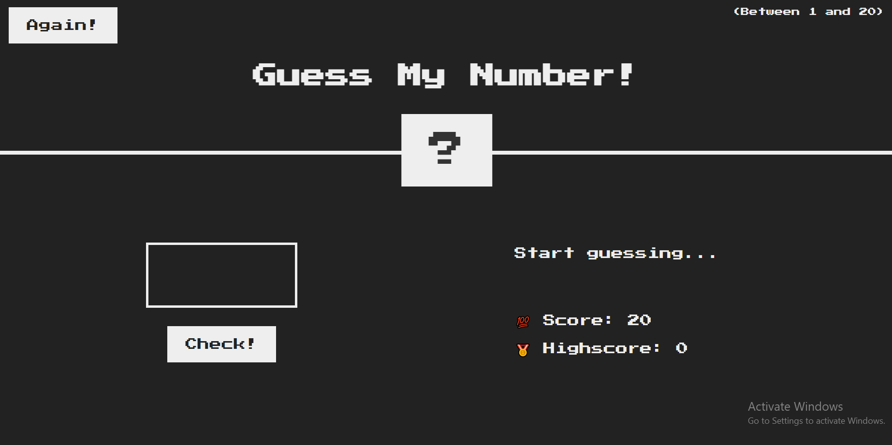
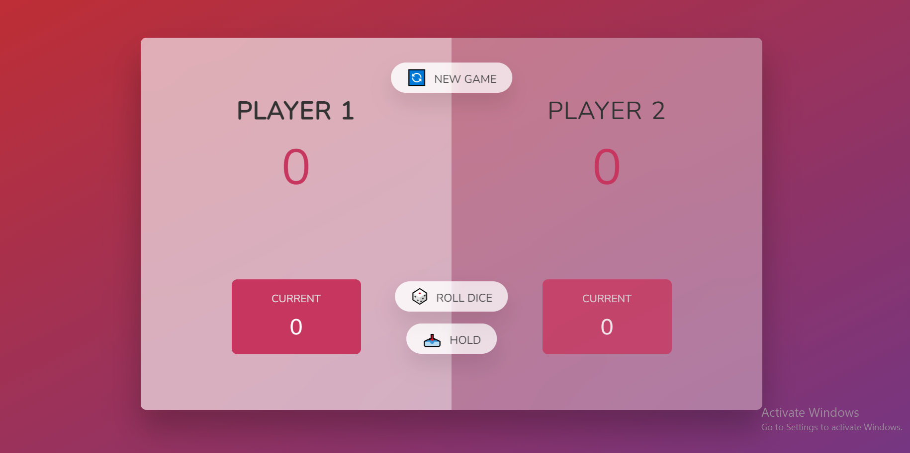

# GamesWithJavaScript
These games I made while I was studying Jonas Schmedtmann's JavaScript course, It is considered as an exercise for the DOM part of the JavaScript language

## First Game (GuessMyNumber)

## Second Game (PigGame)

